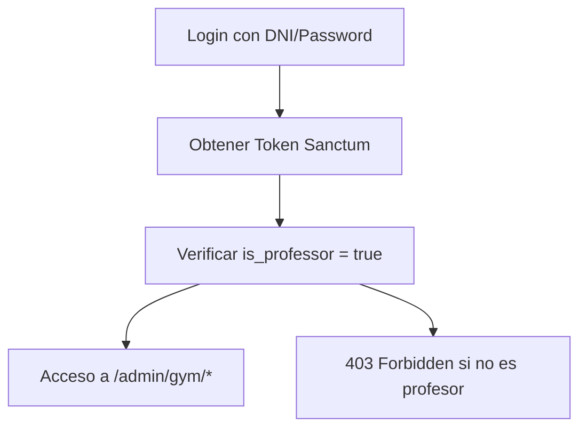

# Gym Service - Internal Flows Documentation

## Visión General de Funcionamiento

El servicio de gimnasios opera bajo un modelo de **plantillas reutilizables** y **asignaciones inmutables**, donde los profesores crean catálogos y plantillas que luego asignan a alumnos como snapshots independientes.

## Funcionamiento General del Sistema

### Principios Arquitectónicos

1. **Separación de Responsabilidades**
   - **Admin**: Profesores gestionan catálogos y asignaciones
   - **Móvil**: Alumnos consultan sus rutinas asignadas
   - **Inmutabilidad**: Asignaciones no cambian una vez creadas

2. **Modelo de Datos Jerárquico**
   ```
   Semana (7 días)
   ├── Día (sesión de entrenamiento)
   │   ├── Ejercicio (movimiento específico)
   │   │   └── Serie (repeticiones + descanso + tempo)
   ```

3. **Flujo de Información Unidireccional**
   ```
   Profesor crea → Sistema almacena → Alumno consume
   ```

### Estados de los Datos

- **Plantillas (Mutables)**: Profesores pueden editar libremente
- **Asignaciones (Inmutables)**: Snapshot fijo para garantizar consistencia
- **Catálogo (Compartido)**: Ejercicios base disponibles para todos los profesores

## Funcionamiento para Admin (Profesores)

### Flujo de Autenticación y Autorización



**Implementación técnica:**
- Middleware `EnsureProfessor` en todas las rutas `/admin/gym/*`
- Campo `users.is_professor` (boolean, indexado)
- Comando Artisan `user:make-professor` para asignar rol

### Flujo de Gestión de Catálogo

#### 1. Gestión de Ejercicios
```
POST /admin/gym/exercises
├── Validación: nombre requerido, tags opcionales
├── Almacenamiento: gym_exercises
└── Respuesta: ejercicio creado con ID
```

**Campos manejados:**
- `name`, `muscle_group`, `movement_pattern`, `equipment`
- `difficulty`, `tags[]`, `instructions`, `tempo`

#### 2. Creación de Plantillas Diarias
```
POST /admin/gym/daily-templates
├── Validación: título requerido, ejercicios opcionales
├── Transacción DB:
│   ├── Crear gym_daily_templates
│   ├── Crear gym_daily_template_exercises (ordenados)
│   └── Crear gym_daily_template_sets (por ejercicio)
└── Respuesta: plantilla con ejercicios y sets anidados
```

**Estructura de datos:**
```json
{
  "title": "Push 60' fuerza",
  "exercises": [
    {
      "exercise_id": 1,
      "order": 1,
      "sets": [
        {"set_number": 1, "reps_min": 8, "reps_max": 10, "rest_seconds": 120}
      ]
    }
  ]
}
```

#### 3. Creación de Plantillas Semanales
```
POST /admin/gym/weekly-templates
├── Validación: título requerido, días opcionales
├── Transacción DB:
│   ├── Crear gym_weekly_templates
│   └── Crear gym_weekly_template_days (mapeo weekday → daily_template_id)
└── Respuesta: plantilla semanal con días
```

### Flujo de Asignación a Alumnos

#### Proceso de Asignación Semanal
```
POST /admin/gym/weekly-assignments
├── Validación: user_id existe, fechas válidas, días con ejercicios
├── Transacción DB (Snapshot):
│   ├── Crear gym_weekly_assignments
│   ├── Crear gym_daily_assignments (por día activo)
│   ├── Crear gym_assigned_exercises (snapshot de ejercicios)
│   └── Crear gym_assigned_sets (snapshot de series)
└── Respuesta: asignación completa con snapshot
```

**Características del Snapshot:**
- **Inmutable**: No cambia aunque se modifiquen las plantillas originales
- **Completo**: Incluye todos los datos necesarios (nombre ejercicio, series, etc.)
- **Independiente**: No depende de referencias a plantillas para funcionar

#### Gestión de Asignaciones Existentes
```
GET /admin/gym/weekly-assignments?user_id=X
├── Filtros: user_id, from/to dates
├── Paginación: 20 por página
└── Respuesta: lista de asignaciones

PUT /admin/gym/weekly-assignments/{id}
├── Campos editables: solo 'notes'
├── Inmutabilidad: ejercicios y sets NO se pueden cambiar
└── Respuesta: asignación actualizada

DELETE /admin/gym/weekly-assignments/{id}
├── Validación: profesor puede eliminar
├── Cascade: elimina días, ejercicios y sets asociados
└── Respuesta: 204 No Content
```

### Optimizaciones para Productividad del Profesor

#### 1. Plantillas Prefijadas (Seeders)
- 20 plantillas diarias listas para usar
- Cubren splits comunes: Full-Body, PPL, Upper/Lower
- Diferentes objetivos: fuerza, hipertrofia, resistencia
- Marcadas con `is_preset = true`

#### 2. Reutilización de Plantillas
- Plantillas semanales combinan plantillas diarias
- Drag-and-drop conceptual para asignación rápida
- Filtros por tags, objetivo, nivel para búsqueda eficiente

#### 3. Funcionalidades Futuras Planeadas
- **Duplicación con progresión**: clonar semana anterior con +reps/+carga
- **Asistente de armado**: sugerencias por split/objetivo/días disponibles
- **Plantillas favoritas**: acceso rápido a las más usadas

## Funcionamiento para App Móvil (Alumnos)

### Flujo de Autenticación
```
POST /api/auth/login (DNI + password)
├── Validación: credenciales correctas
├── Generación: token Sanctum
└── Respuesta: token + datos usuario
```

**Diferencias con Admin:**
- No requiere `is_professor = true`
- Cualquier usuario autenticado puede consultar sus rutinas
- Mismo sistema de tokens Sanctum

### Flujo de Consulta de Rutinas

#### 1. Consulta de Semana Vigente
```
GET /gym/my-week?date=2025-09-22
├── Autenticación: Bearer token
├── Lógica de búsqueda:
│   ├── Buscar gym_weekly_assignments donde user_id = current_user
│   ├── Filtrar por week_start <= date <= week_end
│   └── Cargar gym_daily_assignments relacionados
├── Procesamiento:
│   ├── Generar array de 7 días (lunes-domingo)
│   ├── Marcar has_session = true/false por día
│   └── Incluir título de la sesión si existe
└── Respuesta: estructura de semana con días
```

**Respuesta típica:**
```json
{
  "week_start": "2025-09-22",
  "week_end": "2025-09-28",
  "days": [
    {"weekday": 1, "date": "2025-09-22", "has_session": true, "title": "Full-Body 45'"},
    {"weekday": 2, "date": "2025-09-23", "has_session": false, "title": null}
  ]
}
```

#### 2. Consulta de Día Específico
```
GET /gym/my-day?date=2025-09-22
├── Autenticación: Bearer token
├── Lógica de búsqueda:
│   ├── Buscar gym_weekly_assignments para user_id y rango de fecha
│   ├── Buscar gym_daily_assignments para date exacta
│   └── Cargar gym_assigned_exercises y gym_assigned_sets
├── Procesamiento:
│   ├── Ordenar ejercicios por display_order
│   ├── Ordenar sets por set_number
│   ├── Formatear reps (min-max o valor fijo)
│   └── Incluir todos los campos de prescripción
└── Respuesta: estructura de día con ejercicios y sets
```

**Respuesta típica:**
```json
{
  "title": "Full-Body 45'",
  "exercises": [
    {
      "name": "Sentadilla con barra",
      "order": 1,
      "sets": [
        {"reps": "8-10", "rest_seconds": 120, "tempo": "3-1-1", "rpe_target": 8.0}
      ],
      "notes": "Mantener columna neutra"
    }
  ]
}
```

### Manejo de Estados Especiales

#### Sin Asignación para la Semana
```json
{
  "week_start": null,
  "week_end": null,
  "days": []
}
```

#### Sin Rutina para el Día Específico
```json
{
  "title": null,
  "exercises": []
}
```

#### Sin Asignación para la Fecha (404)
```json
{
  "message": "No assignment found for date"
}
```

## Flujos de Datos Internos

### Modelo de Persistencia

#### Catálogo (Reutilizable)
```sql
gym_exercises (id, name, muscle_group, equipment, tags, instructions)
gym_daily_templates (id, title, goal, duration, level, is_preset)
gym_daily_template_exercises (id, daily_template_id, exercise_id, display_order)
gym_daily_template_sets (id, daily_template_exercise_id, set_number, reps_min, reps_max, rest_seconds)
gym_weekly_templates (id, title, split, days_per_week)
gym_weekly_template_days (id, weekly_template_id, weekday, daily_template_id)
```

#### Asignaciones (Snapshot Inmutable)
```sql
gym_weekly_assignments (id, user_id, week_start, week_end, source_type, created_by)
gym_daily_assignments (id, weekly_assignment_id, weekday, date, title)
gym_assigned_exercises (id, daily_assignment_id, display_order, name, muscle_group, equipment)
gym_assigned_sets (id, assigned_exercise_id, set_number, reps_min, reps_max, rest_seconds, tempo, rpe_target)
```

### Estrategias de Performance

#### Índices Críticos
- `gym_weekly_assignments`: `(user_id, week_start)` para consultas móviles
- `gym_daily_assignments`: `(weekly_assignment_id, weekday)` para ordenamiento
- `gym_assigned_exercises`: `(daily_assignment_id, display_order)` para orden
- `gym_assigned_sets`: `(assigned_exercise_id, set_number)` para orden

#### Consultas Optimizadas
- **my-week**: Una query con join a daily_assignments
- **my-day**: Eager loading de exercises.sets para evitar N+1
- **Admin listings**: Paginación con 20 elementos por página

### Integridad de Datos

#### Constraints de Base de Datos
- Foreign keys con CASCADE/RESTRICT según corresponda
- Unique constraints en combinaciones críticas (user_id + week_start)
- Check constraints en rangos válidos (weekday 1-7, reps > 0)

#### Validaciones de Aplicación
- Form Requests para todos los endpoints POST/PUT
- Validación de fechas (week_end >= week_start)
- Validación de existencia de referencias (user_id, exercise_id)

#### Transacciones
- Creación de plantillas diarias: transacción para ejercicios + sets
- Creación de asignaciones: transacción para toda la estructura de snapshot
- Eliminaciones: cascade automático por foreign keys

## Consideraciones de Escalabilidad

### Crecimiento de Datos
- **Asignaciones**: Crecen linealmente con usuarios × semanas
- **Plantillas**: Crecen lentamente (reutilizables)
- **Catálogo**: Crecimiento mínimo (ejercicios base)

### Estrategias de Optimización
- **Archivado**: Mover asignaciones antiguas (>6 meses) a tablas de archivo
- **Cache**: Cachear my-week por usuario (TTL 1 hora)
- **CDN**: Assets estáticos (imágenes de ejercicios, videos instructivos)

### Monitoreo
- **Queries lentas**: Identificar consultas >100ms
- **Uso de memoria**: Monitorear eager loading excesivo
- **Concurrencia**: Locks en creación simultánea de asignaciones
